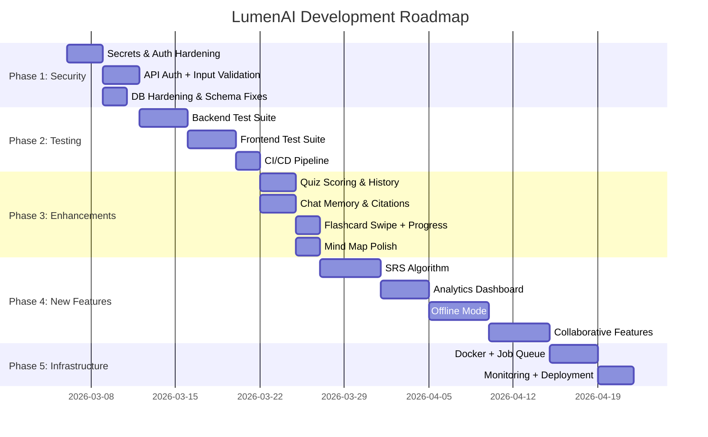

# 🌟 LumenAI — The Definitive Roadmap
**Goal: Transform LumenAI from a strong prototype into a staple-mark learning platform.**

---

## Current State Audit

| Area | Status |
|------|--------|
| Syllabus Ingestion (PDF/PPT/DOCX) | ✅ Working |
| Lecture Recording & Upload | ✅ Working |
| AI Analysis (Gemini + Ollama fallback) | ✅ Working |
| Study Artifacts (Summary, Quiz, Mind Map, Flashcards, Code Sandbox) | ✅ Working |
| RAG Chat (Syllabus-grounded Q&A) | ✅ Working |
| Google Classroom Integration | ✅ Working |
| Calendar with Extracted Deadlines | ✅ Working |
| Auth (Supabase) | ✅ Working |
| RLS Security Policies | ⚠️ Basic (single policy per table) |
| Automated Tests | ⚠️ Backend only, no Flutter tests |
| Error Handling | ⚠️ Inconsistent |
| Offline Support | ❌ Missing |
| Analytics / Progress Tracking | ❌ Missing |
| SRS (Spaced Repetition) | ❌ Missing |

---

## Phase 1: Production Hardening & Security 🔒
**Priority: CRITICAL — Must do before any public release.**

### 1.1 Security Hardening
- [ ] **Move secrets out of source code** — Supabase URL & anon key are currently hardcoded in `main.dart`. Use `--dart-define` or `flutter_dotenv`.
- [ ] **API Authentication** — Backend routes (`/analyze`, `/ask`, `/classroom/*`) have **no auth middleware**. Add JWT verification using Supabase's JWT on every FastAPI route.
- [ ] **Google OAuth token encryption** — `user_integrations.google_tokens` stores raw OAuth credentials in a JSONB column. Encrypt at rest using Supabase Vault or server-side encryption.
- [ ] **Input sanitization** — Add `pydantic` validation models to *all* FastAPI endpoints (many currently use raw `Form(...)` without length/type constraints).
- [ ] **Rate limiting** — Add rate limiting middleware (e.g., `slowapi`) to prevent API abuse, especially on `/analyze` and `/ask` endpoints.
- [ ] **CORS hardening** — Lock down CORS origins to only your app's domain/deep-link scheme.
- [ ] **File upload validation** — Validate file types, enforce max file size (currently unbounded), scan for malicious content before processing.

### 1.2 Error Handling & Resilience
- [ ] **Global error boundary** in Flutter — Catch & display user-friendly errors instead of silent failures or raw exceptions.
- [ ] **Backend structured logging** — Replace `print()` statements with Python `logging` module. Add request IDs for tracing.
- [ ] **Retry logic with exponential backoff** — AI analysis currently has basic retry. Implement proper backoff for Gemini rate limits and transient failures.
- [ ] **Graceful degradation** — If Gemini API is down and Ollama is unavailable, show a clear "AI unavailable" state instead of crashing.
- [ ] **Health check endpoint** — Add `/health` endpoint that checks DB connectivity, Gemini reachability, and Ollama status.

### 1.3 Database Hardening
- [ ] **Granular RLS policies** — Current policies use a single `for all` policy per table. Split into separate `SELECT`, `INSERT`, `UPDATE`, `DELETE` policies.
- [ ] **Add indexes** — Add indexes on `user_id`, `subject_id`, `lecture_id` foreign keys for query performance.
- [ ] **Add `units` table migration** — Schema references `units(id)` but the `CREATE TABLE units` statement is missing from `schema.sql`.
- [ ] **Add `user_integrations` table** to schema — Currently created ad-hoc by the classroom route but not in `schema.sql`.
- [ ] **Data retention policy** — Add `updated_at` timestamps and soft-delete (`deleted_at`) columns for audit trails.

---

## Phase 2: Testing & Quality Assurance ✅
**Priority: HIGH — Foundation for all future development.**

### 2.1 Backend Testing
- [ ] **Unit tests for all routes** — Expand `test_phase2.py` to cover `/ask`, `/classroom/*`, `/ingestion/*` routes.
- [ ] **Mock AI responses** — Create fixtures for Gemini/Ollama responses so tests don't require live API keys.
- [ ] **Integration tests** — End-to-end test: upload audio → process → verify DB records match expected schema.
- [ ] **Edge case tests** — Empty files, corrupt audio, oversized uploads, malformed JSON from AI, expired OAuth tokens.

### 2.2 Frontend Testing
- [ ] **Widget tests** for each page — `HomePage`, `ResultsPage`, `NotesPage`, `AIChatPage`, `MasterCalendarPage`.
- [ ] **Service tests** — Mock `ApiService` HTTP calls and verify correct request construction and response parsing.
- [ ] **Model tests** — Validate `data_models.dart`, `profile.dart`, `calendar_event.dart` serialization/deserialization.
- [ ] **Golden tests** — Capture visual snapshots of key screens to catch UI regressions.

### 2.3 CI/CD Pipeline
- [ ] **GitHub Actions** — Automate `flutter analyze` + `flutter test` + `pytest` on every PR.
- [ ] **Code coverage** — Set minimum 70% coverage threshold, track with Codecov or similar.
- [ ] **Linting** — Add `analysis_options.yaml` with strict rules. Add `ruff` for Python linting.

---

## Phase 3: Enhanced Current Features 🚀
**Priority: HIGH — Polish what exists before adding new things.**

### 3.1 Mind Map Overhaul
- [ ] **Pinch-to-zoom** — Current graph view has limited interactivity on mobile.
- [ ] **Tap-to-expand nodes** — Show deeper definitions when a node is tapped (per PRD spec).
- [ ] **Export as image** — Let students save/share mind maps as PNG/PDF.
- [ ] **Color-coded by topic importance** — Highlight "Exam Alert" nodes in a distinct color.

### 3.2 Quiz Engine Enhancement
- [ ] **Quiz scoring & history** — Track scores per quiz attempt, show progress over time.
- [ ] **Difficulty levels** — Tag questions as Easy/Medium/Hard based on Bloom's taxonomy.
- [ ] **Timed quiz mode** — Simulate exam conditions with a countdown timer.
- [ ] **Explanation deep-dive** — Each wrong answer shows the related syllabus section for review.

### 3.3 Flashcard UX
- [ ] **Swipe gestures** — "Know it" (right) vs "Review again" (left) tracking (per PRD spec).
- [ ] **Confidence tagging** — Mark cards as Confident / Unsure / No Idea to prioritize review.
- [ ] **Visual progress** — Show mastery percentage per subject/unit.

### 3.4 RAG Chat Intelligence
- [ ] **Multi-turn memory** — Current `/ask` endpoint is stateless. Add conversation history to context window.
- [ ] **Citation links** — PRD spec: show `[12:40]` timestamp links back to audio position. Currently not implemented.
- [ ] **Suggested follow-up questions** — After each answer, suggest 2-3 related questions to encourage deeper learning.
- [ ] **Streaming responses** — Use SSE or WebSocket for real-time token-by-token AI response display.

### 3.5 Recording & Upload
- [ ] **Background recording** — Allow students to switch apps while recording (currently pauses).
- [ ] **Upload progress indicator** — Show upload percentage for large audio files.
- [ ] **Resume failed uploads** — Store partial uploads and allow retry without re-recording.
- [ ] **Batch upload** — Upload multiple lecture recordings at once.

---

## Phase 4: New Features — Learning Intelligence 🧠
**Priority: MEDIUM — Differentiators that make LumenAI a staple-mark platform.**

### 4.1 Spaced Repetition System (SRS)
> *From PRD Future Scope*
- [ ] **SM-2 Algorithm** — Implement SuperMemo-2 scheduling for flashcard reviews based on forgetting curves.
- [ ] **Daily review queue** — "Today's Reviews" section on HomePage showing cards due for review.
- [ ] **Streak tracking** — Track consecutive review days, gamify with badges.
- [ ] **Schema changes** — Add `next_review_at`, `ease_factor`, `interval`, `review_count` columns to `flashcards` table.

### 4.2 Learning Analytics Dashboard
- [ ] **Study time tracking** — Log time spent reviewing each subject.
- [ ] **Mastery heatmap** — Calendar-style heatmap showing study intensity per day (like GitHub contributions).
- [ ] **Subject progress bar** — Visual indicator: "You've covered 7/12 units of Data Structures."
- [ ] **Weak area detection** — Flag topics where quiz scores are consistently low.
- [ ] **Weekly summary email/push notification** — "You studied 3.5 hours this week. Quiz accuracy: 78%."

### 4.3 Offline Mode
- [ ] **Local caching** — Cache lectures, flashcards, and summaries using `sqflite` or `hive` for offline access.
- [ ] **Offline review** — Allow flashcard review and quiz attempts without internet.
- [ ] **Sync on reconnect** — Queue offline actions and sync when connection is restored.

### 4.4 Collaborative Mode
> *From PRD Future Scope*
- [ ] **Share notes via QR code** — Generate a QR code for any lecture's study artifacts.
- [ ] **Study group** — Multiple students can pool their lecture notes into a shared subject.
- [ ] **Peer quiz challenge** — Send quiz challenges to classmates.

### 4.5 LMS Integration
> *From PRD Future Scope*
- [ ] **Moodle API integration** — Auto-pull syllabus, assignments, and deadlines from Moodle.
- [ ] **Canvas API integration** — Same for Canvas LMS.
- [ ] **Auto-subject creation** — When connected to LMS, automatically create subjects matching enrolled courses.

---

## Phase 5: Platform & Infrastructure Scaling 🏗️
**Priority: MEDIUM — Prepare for growth.**

### 5.1 Backend Architecture
- [ ] **Dockerize the backend** — Create production `Dockerfile` and `docker-compose.yml` for consistent deployments.
- [ ] **Background job queue** — Replace FastAPI `BackgroundTasks` with a proper job queue (Celery + Redis or `arq`) for lecture processing.
- [ ] **Caching layer** — Add Redis caching for frequently accessed data (subject lists, recent lectures).
- [ ] **File storage optimization** — Move processed audio to cold storage after analysis; only keep metadata active.

### 5.2 Monitoring & Observability
- [ ] **Application monitoring** — Integrate Sentry for error tracking (both Flutter and Python).
- [ ] **API metrics** — Track response times, error rates, and AI processing durations.
- [ ] **Usage analytics** — Track feature adoption (which tabs are used most, average session length).
- [ ] **Alerting** — Set up alerts for API downtime, high error rates, or Gemini quota exhaustion.

### 5.3 Deployment
- [ ] **CI/CD deployment** — Auto-deploy backend to Render.com on `main` branch push.
- [ ] **App store preparation** — Generate release builds, app icons, splash screens, store listings.
- [ ] **Environment management** — Separate `dev`, `staging`, `production` environments with different Supabase projects.

---

## Phase 6: Premium & Differentiation ✨
**Priority: LOW — Features that set LumenAI apart long-term.**

### 6.1 AI Model Flexibility
- [ ] **Model selector** — Let users choose between Gemini Flash (fast), Gemini Pro (detailed), and local Ollama.
- [ ] **Custom system prompts** — Allow students to adjust AI personality ("Explain like I'm 5" vs "Technical depth").
- [ ] **Multi-language support** — Detect lecture language and generate study artifacts in the student's preferred language.

### 6.2 Advanced Study Features
- [ ] **Audio playback with highlights** — Play back lecture audio with synchronized text highlights on key terms.
- [ ] **Annotation layer** — Let students add personal notes/highlights on top of AI-generated summaries.
- [ ] **Cross-lecture connections** — AI identifies related concepts across different lectures/subjects.
- [ ] **Exam prediction** — Based on syllabus coverage tracking, predict likely exam topics.

### 6.3 Social & Gamification
- [ ] **Leaderboard** — Anonymous streak & study-time leaderboard among classmates.
- [ ] **Achievement badges** — "First Flashcard Review", "10-Day Streak", "Quiz Master (100% score)".
- [ ] **Study reminders** — Smart notifications based on SRS schedule and upcoming deadlines.

---

## Suggested Execution Order

---

> [!IMPORTANT]
> **Recommended approach:** Tackle Phase 1 (Security) and Phase 2 (Testing) first. They are non-negotiable for any production-grade platform. Then Phase 3 (polish existing features) will make the biggest user-facing impact with the least risk. Phase 4's SRS feature is the single most differentiating capability for a learning platform.
