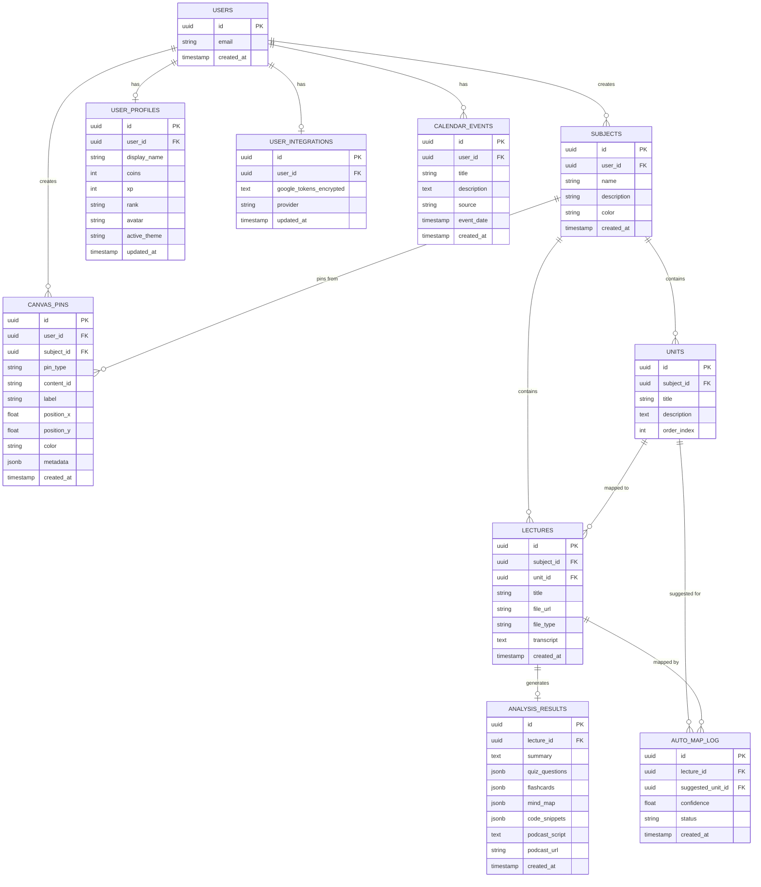
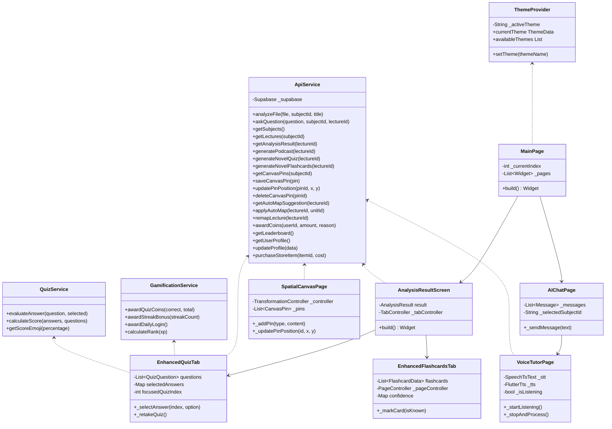
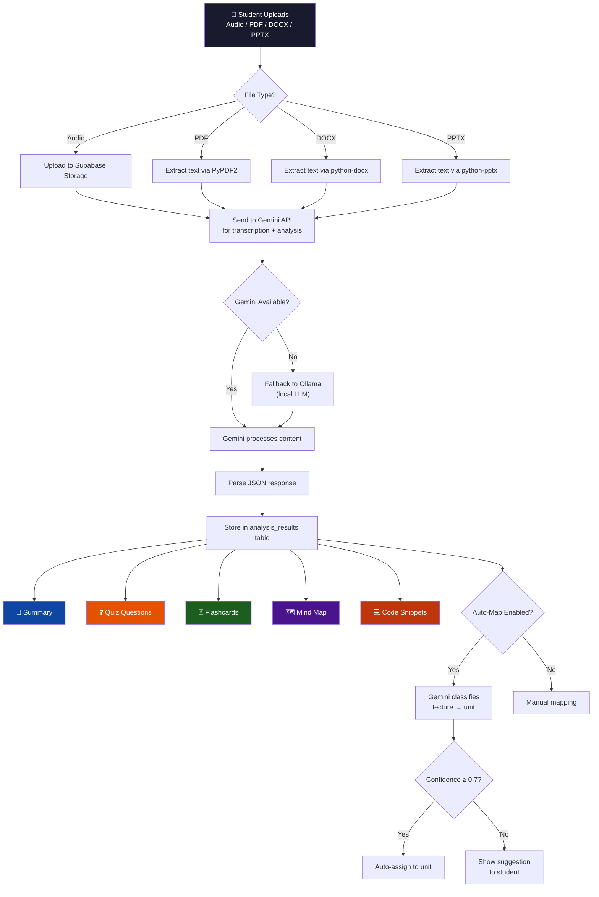
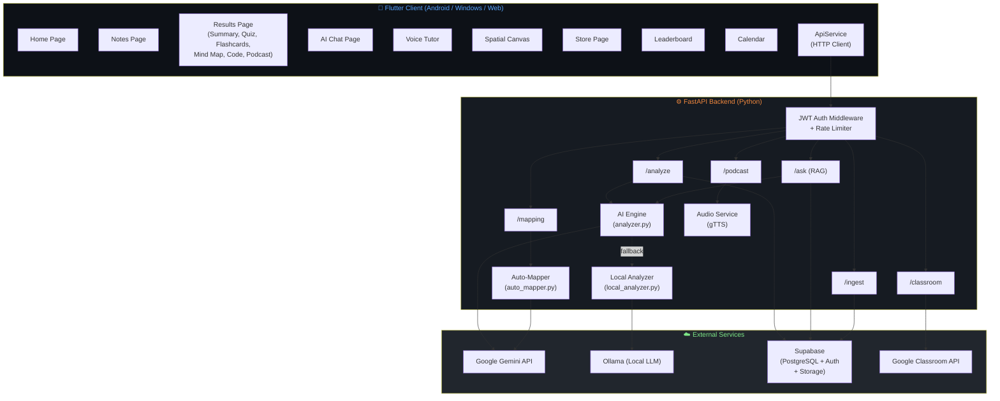
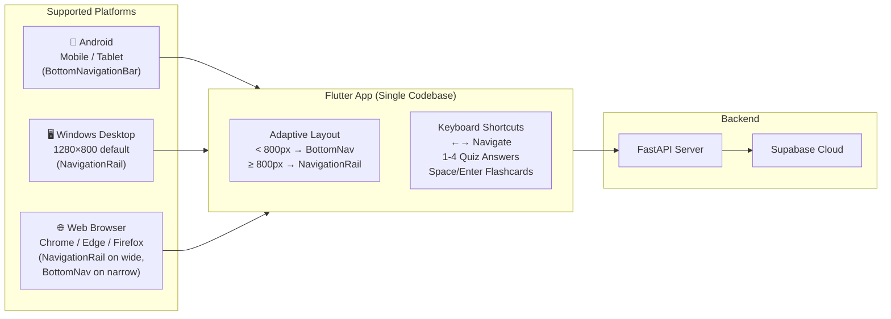
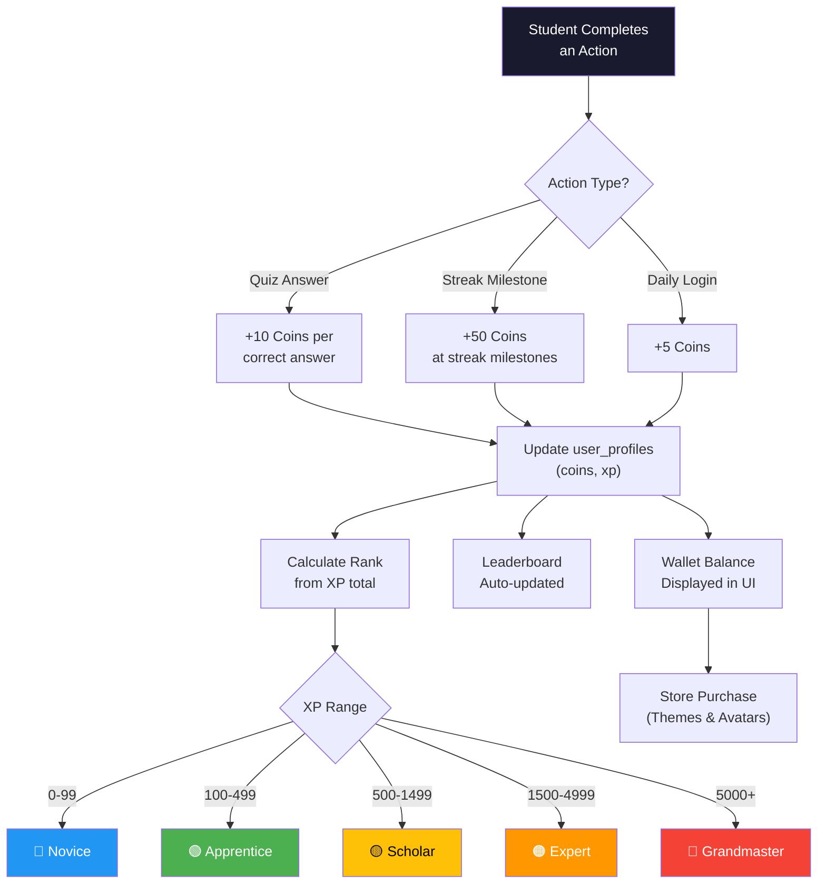
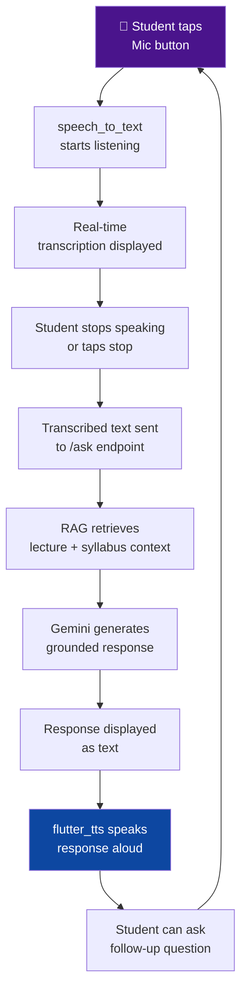

# LumenAI — Updated Diagrams

> **Instructions:** Render these Mermaid diagrams using https://mermaid.live/ or a Mermaid plugin, then export as PNG images to paste into your Word/PDF document.

---

## 2.1 Use Case Diagram

```mermaid
graph TB
    subgraph Student["👤 Student"]
        direction TB
    end

    subgraph LumenAI["🧠 LumenAI System"]
        UC1["Upload Lecture<br/>(Audio/PDF/DOCX/PPTX)"]
        UC2["View AI Summary"]
        UC3["Take Quiz"]
        UC4["Review Flashcards"]
        UC5["View Mind Map"]
        UC6["Use Code Sandbox"]
        UC7["Listen to Podcast"]
        UC8["Chat with AI Tutor<br/>(RAG)"]
        UC9["Voice Tutor Session"]
        UC10["Pin to Spatial Canvas"]
        UC11["Manage Subjects & Units"]
        UC12["Auto-Map Lectures"]
        UC13["Earn Lumen Coins"]
        UC14["View Leaderboard"]
        UC15["Buy Themes & Avatars"]
        UC16["Sync Google Classroom"]
        UC17["View Calendar"]
        UC18["Edit Profile"]
    end

    subgraph External["⚡ External Services"]
        GeminiAPI["Google Gemini API"]
        OllamaLLM["Ollama Local LLM"]
        SupabaseDB["Supabase<br/>(DB + Auth + Storage)"]
        GoogleCR["Google Classroom API"]
        TTS["gTTS / flutter_tts"]
        STT["speech_to_text"]
    end

    Student --> UC1
    Student --> UC2
    Student --> UC3
    Student --> UC4
    Student --> UC5
    Student --> UC6
    Student --> UC7
    Student --> UC8
    Student --> UC9
    Student --> UC10
    Student --> UC11
    Student --> UC12
    Student --> UC13
    Student --> UC14
    Student --> UC15
    Student --> UC16
    Student --> UC17
    Student --> UC18

    UC1 --> GeminiAPI
    UC1 --> OllamaLLM
    UC1 --> SupabaseDB
    UC8 --> GeminiAPI
    UC9 --> STT
    UC9 --> GeminiAPI
    UC9 --> TTS
    UC7 --> TTS
    UC12 --> GeminiAPI
    UC16 --> GoogleCR
    UC13 --> SupabaseDB
```

---

## 2.2 ER Diagram (Entity-Relationship)

---

## 2.3 Class Diagram

---

## 2.4 Flowchart — Lecture Processing Pipeline

---

## 2.5 System Architecture Diagram

---

## 2.6 Client Device Diagram

---

## 2.7 Gamification Flow [NEW]

---

## 2.8 Voice Tutor Flow [NEW]

